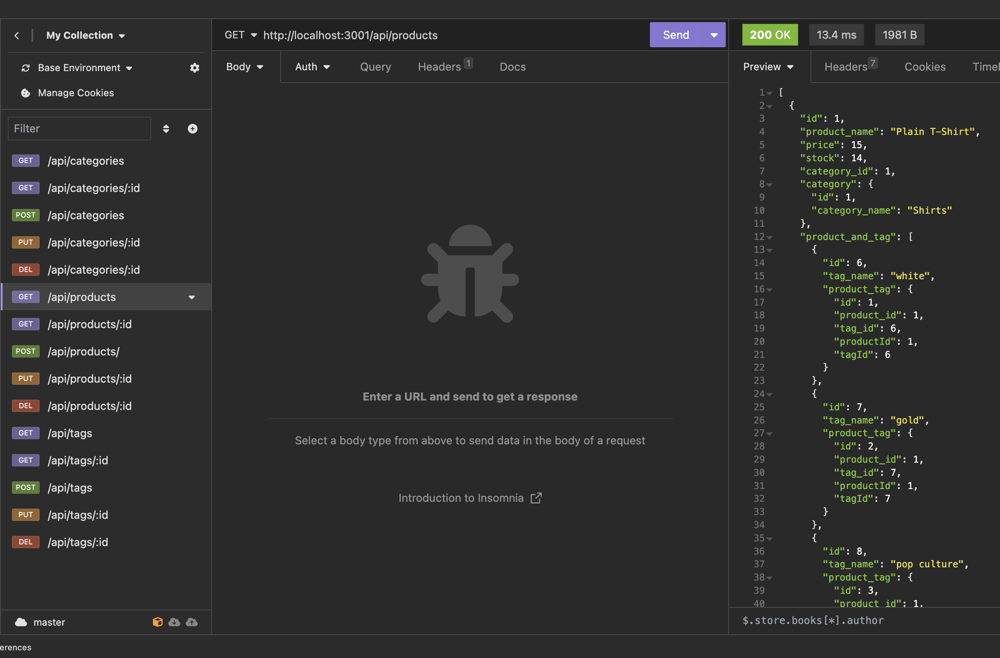

# module13

## Description

This project uses Express.js as a server has routes to CREATE, READ, UPDATE, and DELETE data from a database.  The routes connect to a MySQL database using Sequelize.

## Installation

1.  Download the files from this reposity to your local machine
2.  'cd' to the path where the package.json file is located and run the command "npm i" to install the necessary packages
3.  From the same directory, connect to the MySQL Server and run the following command to create the database
    a.  source db/schema.sql
4.  Update the .env file to have your environment's information
5.  Run "node seeds/" to seed the database with data

## Usage

To interact with the data in the database, you can use a tool such as Insomnia to make GET, POST, PUT, or DELETE request to the express.js server.  A screenshot below shows the available endpoints in Insomnia (left side of the photo).  It also shows the ouput of a PUT request

The following steps outline how to launch and use the application.

1.  'cd' to the root of the file structure and run "node server.js".
2.  Use Insomnia or another tool to make HTTP request to the endpoint

A recording of the application in use can be found here: https://drive.google.com/file/d/1SzPDw_UHVKKW4qKCLIfric3P1SrRlDvg/view

## Credits

The starter code can be found at the following GitHub repo: https://github.com/coding-boot-camp/fantastic-umbrella

## License

N/A
